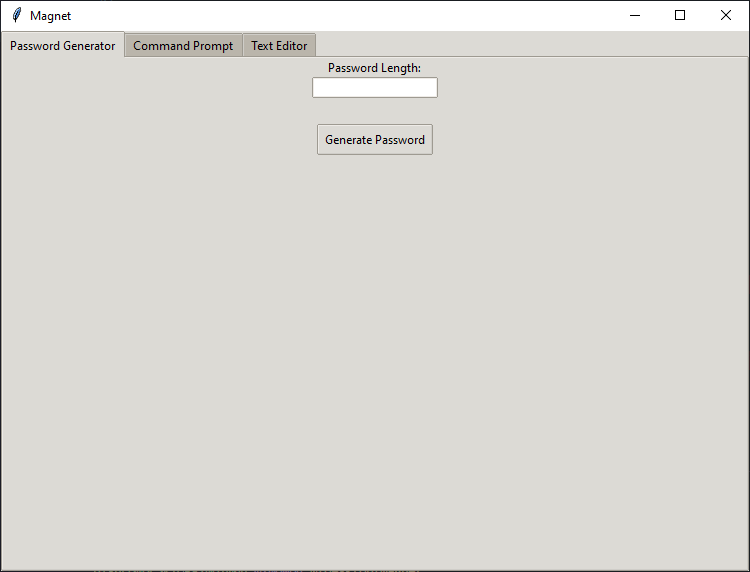
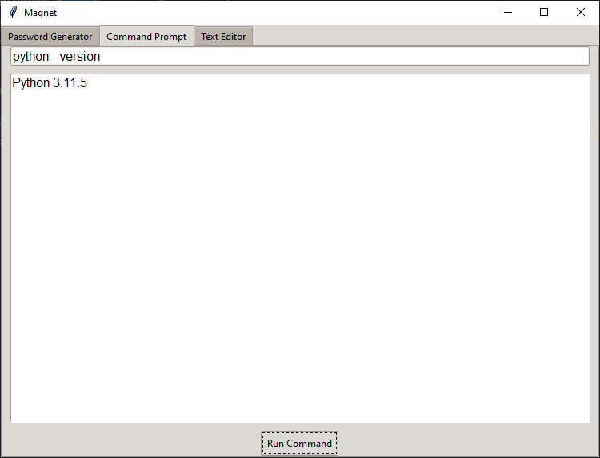
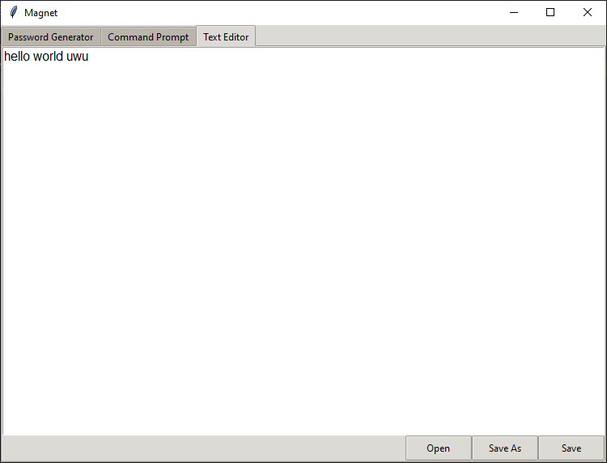

# Magnet

A versatile and user-friendly Python application with features like a password generator, command prompt, text editor, and more.

## Table of Contents
- [Getting Started](#getting-started)
- [Usage](#usage)
- [Features](#features)
- [Screenshots](#screenshots)
- [Contributing](#contributing)
- [License](#license)

## Getting Started

To get started with Magnet, follow these steps:

1. Clone the repository.
2. Install the required dependencies.
3. Run `magnet.exe` in `DIST` to launch the application.

## Usage

- Use the Password Generator to create secure passwords.
- Explore the Command Prompt for executing commands.
- The Text Editor allows you to edit and save text files.

## Features

- Password generation with a custom password length.
- Execution of commands in the command prompt.

Pin it to your taskbar to save time and space in your taskbar!

## Screenshots

## License

This project is licensed under the MIT License - see the [LICENSE](LICENSE/MIT-License.txt) file for details.

## Contact

For questions or support, contact me at [terpomojn@gmail.com](mailto:terpomojn@gmail.com).
